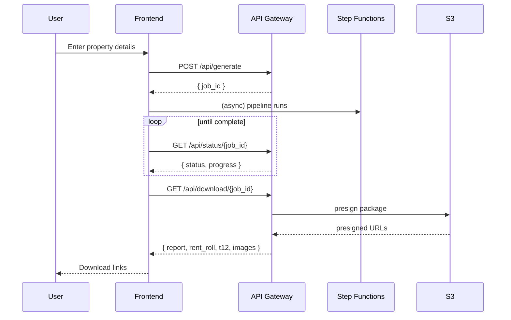
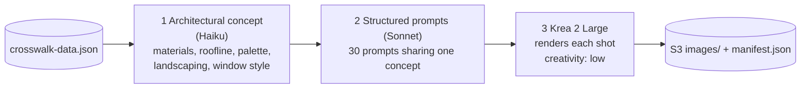

# Synthetic Multifamily Appraisal Generator

A fully automated, serverless system that produces **synthetic multifamily loan appraisal packages** using AI. Enter a property's basic details and the pipeline generates a complete appraisal report (DOCX), rent rolls, T‑12 operating statements, and a consistent property photo package — all wired together by a single master data schema so every number and narrative stays internally consistent.

> **For demonstration and development purposes only.** All output is synthetic and must not be used for real lending, valuation, or underwriting decisions.

---

## Architecture

```mermaid
flowchart TD
    UI["Frontend<br/>React + Vite (Vercel)"] -->|POST /api/generate| APIGW["API Gateway (REST)"]
    APIGW --> IV["Input Validator<br/>Lambda"]
    IV -->|StartExecution| SFN["Step Functions<br/>Orchestrator"]

    SFN --> CW["Crosswalk Generator (Haiku)<br/>master data schema + arithmetic tools"]

    CW --> FANOUT{{"Parallel fan‑out"}}
    FANOUT --> SEC["Section Generators 1–12<br/>Haiku / Sonnet / Opus"]
    FANOUT --> T12["T‑12 &amp; Rent Roll<br/>openpyxl"]
    FANOUT --> IMG["Image Generator<br/>Haiku concept → Sonnet prompts → Krea 2 Large"]

    SEC --> QC["QC Validator (Sonnet)<br/>consistency checks"]
    T12 --> QC
    IMG --> QC

    QC --> ASM["Document Assembler<br/>Pandoc + python-docx"]
    ASM --> S3[("Amazon S3")]
    S3 -->|presigned URLs| DL["Download Handler<br/>Lambda"]
    DL -->|GET /api/download/{job_id}| UI
```

### Request lifecycle



---

## Pipeline stages

| # | Stage | Model / Tooling | Purpose |
|---|-------|-----------------|---------|
| 1 | **Input Validator** | — | Validates and normalizes user input, starts the Step Functions execution |
| 2 | **Crosswalk Generator** | Claude Haiku + arithmetic tools | Produces the master `crosswalk-data.json` — the single source of truth every downstream stage reads from |
| 3 | **Section Generators (×12)** | Haiku / Sonnet / Opus | Generate the 12 narrative appraisal sections in parallel |
| 3 | **T‑12 / Rent Roll** | openpyxl | Builds Excel operating statements and rent rolls from the crosswalk |
| 3 | **Image Generator** | Haiku → Sonnet → Krea 2 Large | Establishes one architectural concept, generates 30 structured prompts, renders a consistent photo package |
| 4 | **QC Validator** | Claude Sonnet | Cross-checks arithmetic and narrative consistency against the crosswalk |
| 5 | **Document Assembler** | Pandoc + python-docx | Assembles the final DOCX and bundles all deliverables into a ZIP |
| 6 | **Download Handler** | — | Returns presigned S3 URLs for the finished package |

### Section-to-model mapping

The 12 appraisal sections are assigned to models based on reasoning difficulty — cheap/fast models for boilerplate, frontier models for the valuation-heavy sections.

| Section | Title | Model |
|---------|-------|-------|
| 01 | Introduction | Haiku |
| 02 | Property Description | Sonnet |
| 03 | Market Analysis | Sonnet |
| 04 | Highest and Best Use | Haiku |
| 05 | Valuation Methodology | Haiku |
| 06 | Sales Comparison Approach | Opus |
| 07 | Income Approach | Opus |
| 08 | Cost Approach | Haiku |
| 09 | Reconciliation | Opus |
| 10 | Assumptions & Limiting Conditions | Haiku |
| 11 | Certification | Haiku |
| 12 | Addenda | Haiku |

---

## Image generation

Consistency is the hard part of an AI photo package: 30 independently generated images can easily look like 30 unrelated buildings. This pipeline solves that in three steps:



1. **Architectural concept (Haiku)** — one pass establishes a single, concrete visual identity for the property (exterior materials, color palette, roofline, window style, landscaping theme, site features).
2. **Structured prompts (Sonnet)** — all 30 prompts are generated in one call, each threaded through the shared concept, using a fixed 7‑section structure (Subject, Architecture details, Landscaping, Lighting/atmosphere, Camera, Style tags, Negative prompt suggestions).
3. **Rendering (Krea 2 Large)** — each prompt is rendered at low `creativity` to minimize drift, keeping garden-style properties consistently garden-style, high-rise consistently high-rise.

See [templates/image_prompts.md](templates/image_prompts.md) for the shot list and prompt structure.

---

## Tech Stack

| Layer | Technology |
|-------|-----------|
| Frontend | React 18 + TypeScript + Tailwind CSS + Vite (Vercel) |
| API | AWS API Gateway (REST) |
| Orchestration | AWS Step Functions |
| Compute | AWS Lambda (Python 3.11) |
| AI Models | AWS Bedrock (Claude Haiku, Sonnet 5, Opus 5 via cross-region inference profiles) |
| Images | Replicate API (Krea 2 Large) |
| Storage | Amazon S3 |
| Notifications | Amazon SNS |
| IaC | AWS CDK v2 (Python) |
| Documents | Pandoc, python-docx, openpyxl |

---

## Quick Start

### Prerequisites

- Python 3.11+
- Node.js 18+
- AWS CLI configured with appropriate credentials
- AWS CDK CLI (`npm install -g aws-cdk`)
- Pandoc installed
- Replicate API token
- Bedrock access to the Claude Sonnet and Opus cross-region inference profiles

### Setup

```bash
# Clone and install Python dependencies
pip install -r requirements.txt

# Install frontend dependencies
cd frontend && npm install && cd ..

# Copy and fill in environment variables
cp .env.example .env
# Edit .env with your values (see Configuration below)
```

### Deploy Backend

```bash
# Bootstrap CDK (first time only)
cdk bootstrap

# Deploy all stacks
cdk deploy --all
```

The backend requires `BEDROCK_SONNET_MODEL_ARN` and `BEDROCK_OPUS_MODEL_ARN` to be set in your environment at deploy time — the CDK synth will fail fast if either is missing.

### Deploy Frontend

```bash
cd frontend
cp .env.example .env.local
# Set VITE_API_URL to your API Gateway URL
npm run build
vercel --prod
```

---

## Project Structure

```
mf_data_generator/
├── cdk/                          # AWS CDK infrastructure
│   ├── app.py                    # CDK app entry point
│   └── stacks/
│       ├── storage_stack.py      # S3, SNS
│       ├── lambda_stack.py       # All Lambda functions
│       ├── stepfunctions_stack.py # Step Functions state machine
│       └── api_stack.py          # API Gateway
├── lambdas/
│   ├── shared/                   # Shared utilities
│   │   ├── models.py             # Pydantic crosswalk schema
│   │   ├── bedrock_client.py     # Bedrock API client
│   │   ├── agent_tools.py        # Strands arithmetic/S3 tools
│   │   ├── s3_utils.py           # S3 read/write helpers
│   │   └── section_generator.py  # Base class for sections
│   ├── input_validator/          # Validates user input
│   ├── crosswalk_generator/      # Generates master data (CRITICAL)
│   ├── section_generators/       # 12 appraisal sections (see mapping above)
│   ├── image_generator/          # Krea 2 Large image generation
│   ├── t12_generator/            # Excel T-12 and rent roll
│   ├── qc_validator/             # Data consistency checks
│   ├── assembler/                # DOCX assembly + ZIP
│   ├── lucky_generator/          # "I'm Feeling Lucky" seed data
│   ├── status_checker/           # Job status API
│   └── download_handler/         # Presigned URL API
├── frontend/                     # React SPA
├── templates/                    # Markdown templates
├── tests/                        # pytest test suite
└── scripts/                      # Deploy scripts
```

---

## API Endpoints

| Method | Path | Description |
|--------|------|-------------|
| POST | `/api/generate` | Start appraisal generation |
| POST | `/api/lucky` | Generate randomized seed property data |
| GET | `/api/status/{job_id}` | Check generation progress |
| GET | `/api/download/{job_id}` | Get presigned download URLs |

---

## Configuration

### Backend (`.env`)

| Variable | Description |
|----------|-------------|
| `AWS_ACCOUNT_ID` | AWS account ID |
| `AWS_REGION` | AWS region (default: `us-east-1`) |
| `REPLICATE_API_TOKEN` | Replicate API key for image generation |
| `S3_BUCKET` | S3 bucket name |
| `BEDROCK_SONNET_MODEL_ARN` | Bedrock inference-profile ARN for Claude Sonnet |
| `BEDROCK_OPUS_MODEL_ARN` | Bedrock inference-profile ARN for Claude Opus |

Using **cross-region inference profile ARNs** (rather than single-region model IDs) gives the pipeline automatic cross-region capacity for Sonnet and Opus.

### Frontend (`frontend/.env.local`)

| Variable | Description |
|----------|-------------|
| `VITE_API_URL` | Base URL of the deployed API Gateway stage |

---

## Testing

```bash
pytest tests/ -v
```
